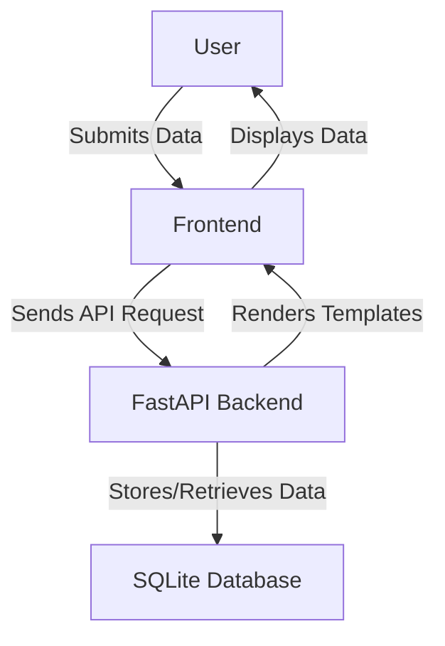

# Decentralized Identity Verification System

## Overview
The Decentralized Identity Verification System is a cutting-edge application that leverages blockchain principles to provide a secure and efficient method for identity verification. In an era where data privacy and security are paramount, this system offers a decentralized and tamper-proof solution for managing identity data. It is designed to cater to the needs of businesses, governmental agencies, and educational institutions that demand a reliable and scalable identity verification process.

By utilizing a user-friendly web interface, individuals can submit their identity data, track the status of their verification requests in real-time, and access their verification history. The system's backend, built with FastAPI, ensures quick response times and robust data handling, while the frontend, crafted with Bootstrap and custom CSS, guarantees a seamless experience across devices.

## Features
- **User-Friendly Interface**: An intuitive web interface allows users to easily submit and track identity verification requests.
- **Secure Data Handling**: Identity data is securely stored and managed using SQLite, ensuring data integrity and confidentiality.
- **Real-Time Verification Status**: Users can monitor the status of their verification requests in real-time, providing transparency and peace of mind.
- **Verification History**: A comprehensive history of all verification requests made by a user is accessible, enhancing user control and oversight.
- **API Documentation**: Detailed API documentation is available for developers looking to integrate the system with other applications.
- **Responsive Design**: The application features a mobile-friendly design using Bootstrap and custom CSS, ensuring accessibility across devices.
- **FastAPI Backend**: A fast and efficient backend built with FastAPI, ensuring quick response times and robust data processing.

## Tech Stack
| Technology     | Description                   |
|----------------|-------------------------------|
| Python         | Programming language          |
| FastAPI        | Web framework for the backend |
| Uvicorn        | ASGI server for FastAPI       |
| Jinja2         | Templating engine             |
| Pydantic       | Data validation library       |
| SQLite         | Database for data storage     |
| Bootstrap      | Frontend framework            |
| JavaScript     | Client-side scripting         |

## Architecture
The project is structured to efficiently serve the frontend through a FastAPI backend. The backend handles API requests, processes data, and interacts with the SQLite database to store and retrieve user and verification information.



## Getting Started

### Prerequisites
- Python 3.11+
- pip (Python package manager)

### Installation
1. Clone the repository:
   ```bash
   git clone https://github.com/yourusername/decentralized-identity-verification-system-auto.git
   cd decentralized-identity-verification-system-auto
   ```
2. Install dependencies:
   ```bash
   pip install -r requirements.txt
   ```
3. Set up the database:
   ```bash
   python app.py
   ```
   This will initialize the SQLite database with required tables and seed data.

### Running the Application
Start the application using Uvicorn:
```bash
uvicorn app:app --host 0.0.0.0 --port 8000
```
Visit `http://localhost:8000` to access the application.

## API Endpoints
| Method | Path                                | Description                         |
|--------|-------------------------------------|-------------------------------------|
| GET    | /                                   | Home page                           |
| GET    | /verify                             | Verification page                   |
| GET    | /dashboard                          | User dashboard                      |
| GET    | /api-docs                           | API documentation page              |
| GET    | /about                              | About page                          |
| POST   | /api/verify-identity                | Submit identity verification request|
| GET    | /api/verification-status/{user_id}  | Get verification status by user ID  |
| GET    | /api/verification-history/{user_id} | Get verification history by user ID |

## Project Structure
```
.
├── Dockerfile                   # Docker configuration file
├── app.py                       # Main application file
├── requirements.txt             # Python dependencies
├── start.sh                     # Shell script to start the application
├── static                       # Static files (CSS, JS)
│   ├── bootstrap.min.css        # Bootstrap CSS
│   ├── css
│   │   └── style.css            # Custom styles
│   └── js
│       └── main.js              # Custom JavaScript
└── templates                    # HTML templates
    ├── about.html               # About page template
    ├── api_docs.html            # API documentation template
    ├── dashboard.html           # User dashboard template
    ├── home.html                # Home page template
    └── verify.html              # Verification page template
```

## Screenshots
Screenshots of the application in action will be placed here.

## Docker Deployment
To build and run the application using Docker:
```bash
docker build -t identity-verification-system .
docker run -d -p 8000:8000 identity-verification-system
```

## Contributing
Contributions are welcome! Please fork the repository and submit a pull request for review.

## License
This project is licensed under the MIT License.

---
Built with Python and FastAPI.
